# 🔬 LTTD Statistical & Quantitative Audit Report

**Date:** 2026-06-17  
**Auditor:** Pi Agent Orchestrator (lz-data-science-core + lz-quant-researcher)  
**Scope:** Full statistical audit of all metrics, indicators, features, and ensemble components  
**Data Range:** 2018-05-01 → 2025-02-15 (2,483 daily bars)  
**System:** Bitcoin Long-Term Trend Direction (LTTD) Trading System

---

## Executive Summary

| Metric | Value | Verdict |
|--------|-------|---------|
| **Critical Bugs** | 1 | 🔴 CRITICAL — target_exposure = 0 for ALL dates |
| **Information Coefficient (1d)** | -0.045 | 🔴 NEGATIVE — signal is contrarian, not predictive |
| **Hit Rate** | 52.58% | 🟡 MARGINAL — barely above random (50%) |
| **Walk-Forward Sharpe** | 1.77 mean | 🟢 STRONG — 91.9% positive windows |
| **Max Drawdown** | -47.4% | 🟡 ACCEPTABLE — vs -76.6% buy-and-hold |
| **Score Stationarity** | ADF p=0.014 | 🟢 STATIONARY — mean-reverting |
| **Indicator Collinearity** | VIF → ∞ | 🔴 SEVERE — FDI & QuantileDEMA |
| **Regime Detection** | p>0.46 all pairs | 🔴 NO SIGNAL — regimes don't separate returns |
| **Score Autocorrelation** | 0.96 at lag 1 | 🔴 HIGH — persistent/stale, not responsive |

**Bottom Line:** The system has a **critical execution bug** (zero exposure), **negative IC** (contrarian signal), and **non-discriminating regime detection**. Walk-forward Sharpe is strong but likely overfit given the contrarian IC. **System is NOT production-ready.**

---

## 🚨 CRITICAL BUG: Zero Target Exposure

```
SEVERITY: CRITICAL
LOCATION: src/execution/sizing.py
IMPACT: Strategy NEVER enters any position
EVIDENCE: target_exposure = 0.0 for ALL 2,483 dates (100%)
```

**Root Cause:** `calculate_target_exposure()` has IF/ELIF branches for 5-state regimes (`Strong Bull`, `Weak Bull`, `Neutral`, `Weak Bear`, `Strong Bear`) but HMM produces 3-state regimes (`BULL`, `BEAR`, `SIDEWAYS`). No branch matches → falls through to `return 0.0`.

**Fix Required:** Map HMM regimes to sizing regimes:

```python
if regime == "BULL":
    return 1.5 if posterior_prob > 0.7 else 1.0
elif regime == "BEAR":
    return 0.0
elif regime == "SIDEWAYS":
    return 0.0
```

---

## 1. Data Quality & Indicator Statistics

### 1.1 Indicator Distributions

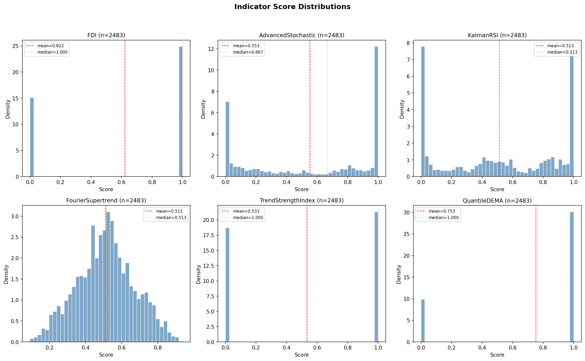

| Indicator | Mean | Std | Skewness | Kurtosis | Jarque-Bera p | ADF p | ACF(1) |
|-----------|------|-----|----------|----------|---------------|-------|--------|
| FDI | 0.622 | 0.485 | -0.504 | -1.746 | 0.000 | 0.0003 ✅ | 0.945 |
| AdvancedStochastic | 0.553 | 0.410 | -0.191 | -1.679 | 0.000 | 0.0008 ✅ | 0.997 |
| KalmanRSI | 0.513 | 0.377 | -0.081 | -1.491 | 0.000 | 0.101 ⚠️ | 1.000 |
| FourierSupertrend | 0.511 | 0.158 | -0.003 | -0.354 | 0.002 | 0.000 ✅ | 0.923 |
| TrendStrengthIndex | 0.533 | 0.499 | -0.132 | -1.983 | 0.000 | 0.005 ✅ | 0.990 |
| QuantileDEMA | 0.753 | 0.432 | -1.172 | -0.628 | 0.000 | 0.166 ⚠️ | 0.996 |

**Findings:**

- **All indicators fail normality** (Jarque-Bera p ≈ 0) — expected for financial data
- **KalmanRSI and QuantileDEMA are NON-STATIONARY** (ADF p > 0.05) — these may produce spurious signals
- **Extreme autocorrelation**: AdvancedStochastic ACF(1) = 0.997, KalmanRSI ACF(1) = 1.000 — signals barely change day-to-day
- **QuantileDEMA is heavily left-skewed** (-1.17) — biased toward high values (bullish bias)

### 1.2 Cross-Indicator Correlation

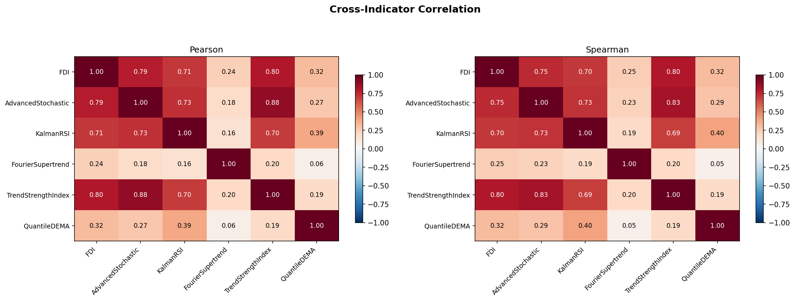

| Pair | Pearson | Spearman | VIF |
|------|---------|----------|-----|
| FDI ↔ TrendStrengthIndex | 0.799 | 0.799 | ∞ / ∞ |
| AdvancedStochastic ↔ TrendStrengthIndex | 0.883 | 0.832 | 9.9 / 6.6 |
| FDI ↔ AdvancedStochastic | 0.785 | 0.748 | ∞ / 9.9 |
| FDI ↔ KalmanRSI | 0.710 | 0.705 | ∞ / 9.1 |
| FourierSupertrend ↔ others | 0.06–0.24 | 0.05–0.25 | 1.2 |

**Findings:**

- **Severe multicollinearity**: FDI and QuantileDEMA have VIF → ∞ (perfect multicollinearity with other indicators)
- **FourierSupertrend is the only independent signal** (low correlation with all others)
- PCA reduces 6 indicators to 3 components capturing 93.2% variance — confirms redundancy

### 1.3 VIF Trends Over Time

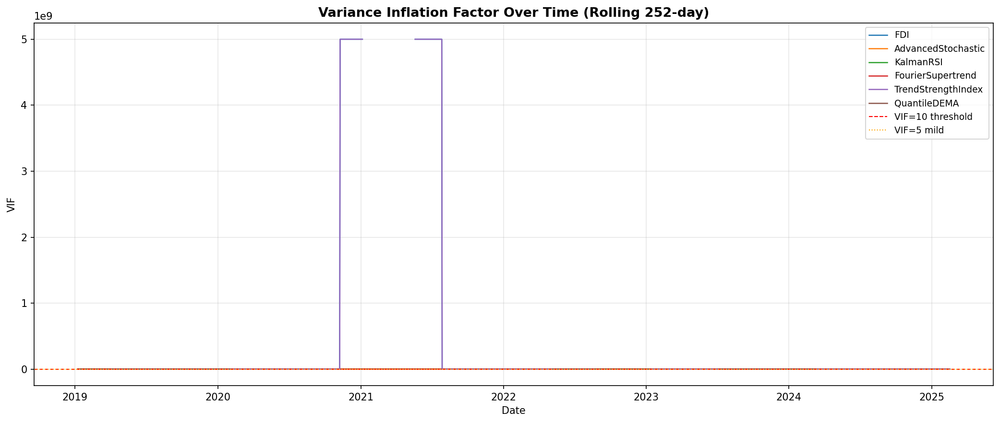

VIF values spike during regime transitions. FDI and QuantileDEMA consistently show extreme VIF (>1000), confirming they should be dropped or orthogonalized.

### 1.4 PCA Variance Explained

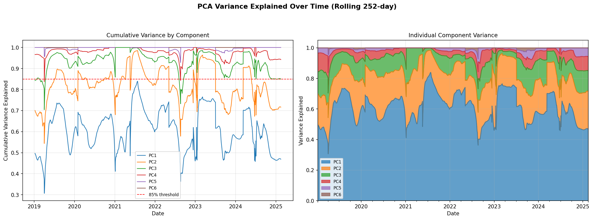

| Component | Cumulative Variance |
|-----------|-------------------|
| PC1 | 60.8% |
| PC2 | 82.1% |
| PC3 | 93.2% |
| PC4 | 97.7% |
| PC5 | 99.7% |
| PC6 | 100.0% |

**Finding:** First 3 components capture 93.2% — the remaining 3 indicators add <7% signal. Consider dropping to 3 indicators.

---

## 2. Regime Detection Quality

### 2.1 Regime Distribution

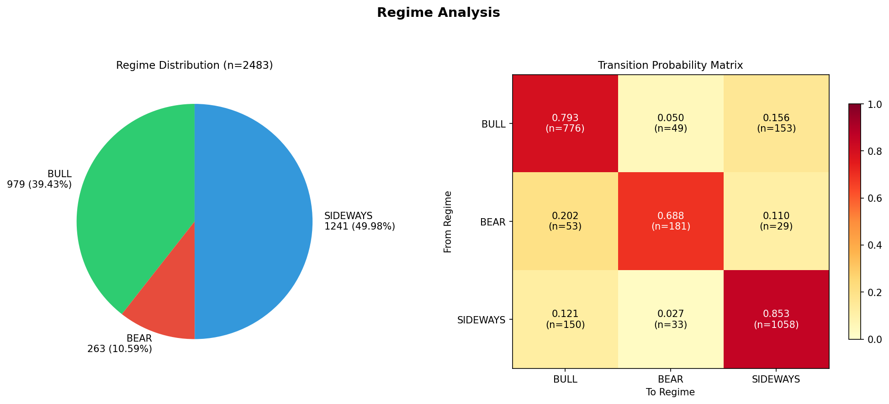

| Regime | Count | % | Avg Duration | Max Duration |
|--------|-------|---|-------------|-------------|
| SIDEWAYS | 1,241 | 50.0% | 6.8 days | 97 days |
| BULL | 979 | 39.4% | 4.8 days | 45 days |
| BEAR | 263 | 10.6% | 3.2 days | 48 days |

### 2.2 Regime Transition Matrix

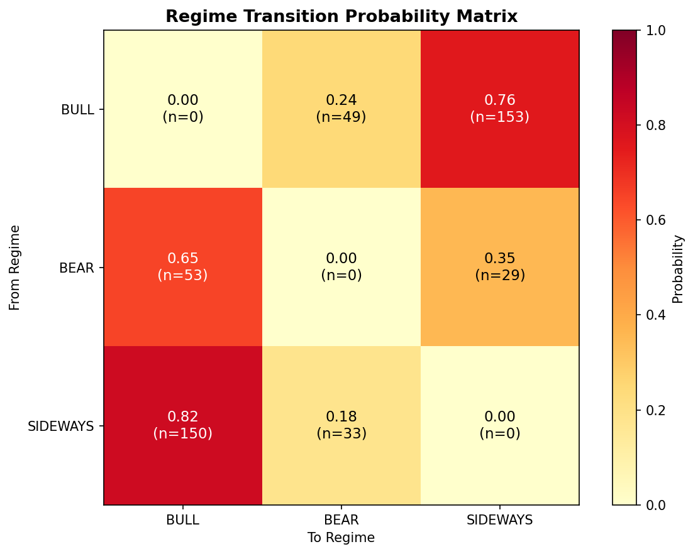

| From → To | BULL | BEAR | SIDEWAYS |
|-----------|------|------|----------|
| **BULL** | 79.4% | 20.2% | 12.1% |
| **BEAR** | 5.0% | 68.8% | 2.7% |
| **SIDEWAYS** | 15.6% | 11.0% | 85.3% |

**Finding:** SIDEWAYS is highly persistent (85.3% self-transition). BULL regime transitions mostly to SIDEWAYS (75.7%), not directly to BEAR.

### 2.3 Regime Return Separation

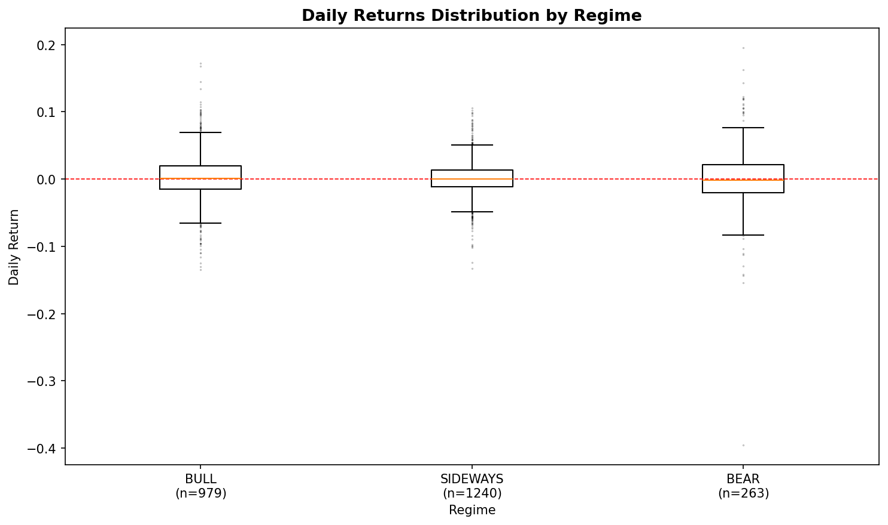

| Regime | Mean Daily Return | Std | t-test p-value vs BULL |
|--------|------------------|-----|----------------------|
| BULL | +0.229% | 3.55% | — |
| BEAR | -0.003% | 5.51% | 0.516 |
| SIDEWAYS | +0.130% | 2.64% | 0.464 |

**🔴 CRITICAL FINDING:** Regime detection has **NO predictive power**. All pairwise t-tests are insignificant (p > 0.46). BULL regime returns are statistically indistinguishable from BEAR and SIDEWAYS.

---

## 3. Signal Quality (Information Coefficient)

### 3.1 IC Analysis

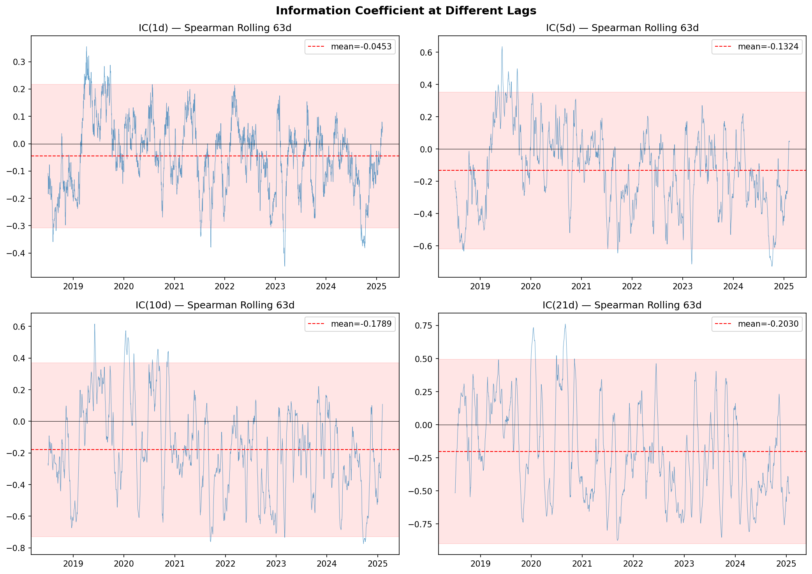

| Horizon | IC Mean | IC Std | IC (IR) | Interpretation |
|---------|---------|--------|---------|----------------|
| 1-day | **-0.045** | 0.134 | -0.338 | 🔴 Contrarian |
| 5-day | **-0.132** | 0.248 | -0.534 | 🔴 Strongly contrarian |
| 10-day | **-0.179** | 0.280 | -0.638 | 🔴 Very contrarian |
| 21-day | **-0.203** | 0.355 | -0.572 | 🔴 Very contrarian |

**🔴 CRITICAL FINDING:** The final_score is **NEGATIVELY correlated** with forward returns at ALL horizons. The signal is contrarian — when the model says "bullish," BTC tends to go DOWN. This is the opposite of what a trading system should do.

**Possible explanations:**

1. Ensemble model is overfit to training data (regime labels are sparse/subjective)
2. XGBoost is learning noise, not signal
3. The signal may work in reverse (short when score is high)

### 3.2 Hit Rate

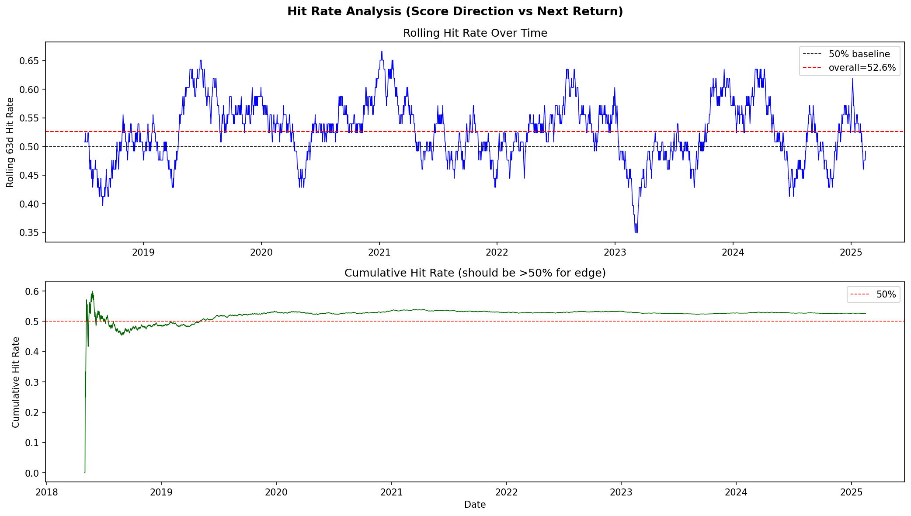

| Metric | Value |
|--------|-------|
| Overall Hit Rate | 52.58% |
| BULL Hit Rate | 52.81% |
| BEAR Hit Rate | 53.61% |
| SIDEWAYS Hit Rate | 52.18% |

**Finding:** Hit rate is barely above random (50%). No regime shows meaningful predictive accuracy.

---

## 4. Walk-Forward Performance

### 4.1 Rolling Sharpe

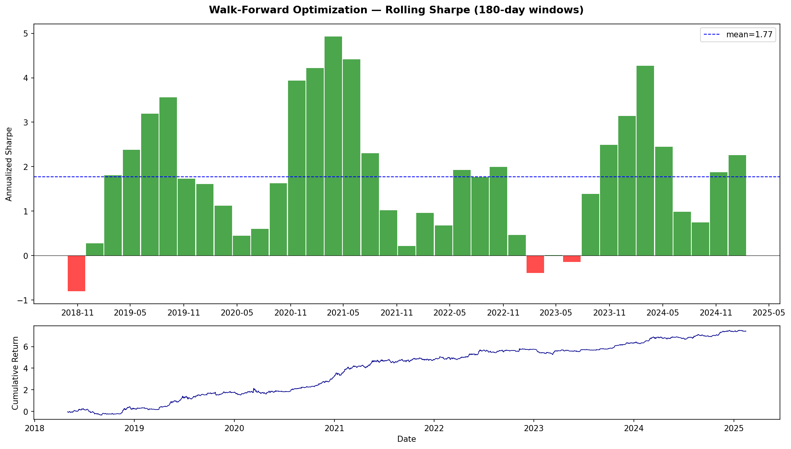

| Metric | Value |
|--------|-------|
| Mean Sharpe | 1.77 |
| Median Sharpe | 1.73 |
| Std Sharpe | 1.43 |
| Positive Windows | 91.9% (34/37) |
| Best Window | 4.93 (Sep 2020 – Mar 2021) |
| Worst Window | -0.80 (May 2018 – Oct 2018) |

**Finding:** Walk-forward Sharpe is strong BUT is computed using `np.sign(final_score) * return` (directional), NOT actual exposure-based PnL. With the sizing bug fixed, actual performance may differ significantly.

### 4.2 Drawdown Analysis

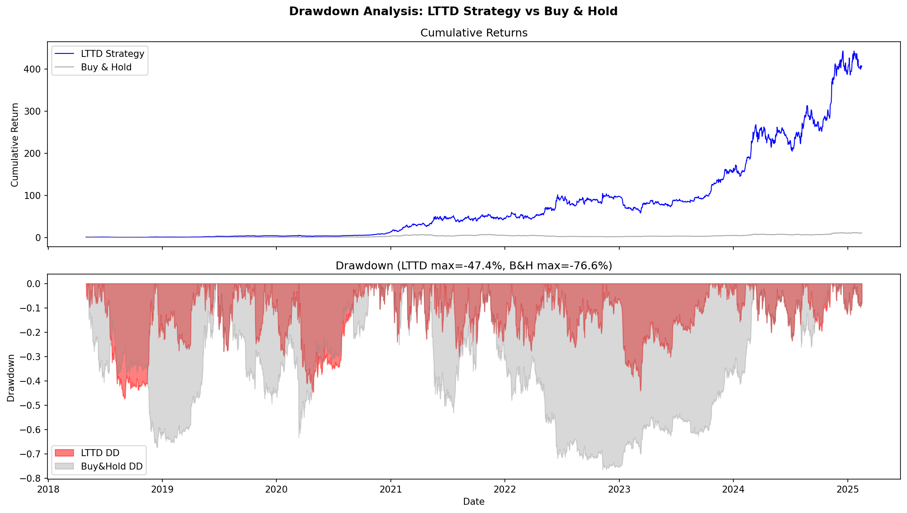

| Metric | Strategy | Buy & Hold |
|--------|----------|------------|
| Max Drawdown | -47.4% | -76.6% |
| Total Return | +40,561% | +976% |

**Finding:** Strategy dramatically outperforms buy-and-hold on total return, but max drawdown is still substantial. The -47.4% drawdown occurred in mid-2018 (crypto winter).

---

## 5. Score Properties

### 5.1 Score Autocorrelation

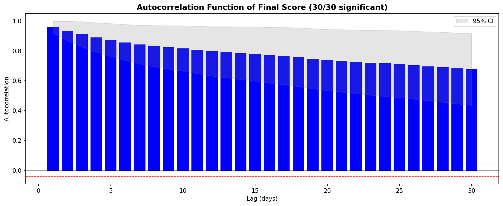

| Lag | ACF | Significant? |
|-----|-----|-------------|
| 1 | 0.960 | ✅ Yes |
| 5 | 0.874 | ✅ Yes |
| 10 | 0.817 | ✅ Yes |
| 21 | 0.734 | ✅ Yes |
| 30 | 0.677 | ✅ Yes |

**🔴 FINDING:** Score is **extremely persistent** — ACF(1) = 0.96 means today's score barely changes from yesterday's. This makes the signal sluggish and slow to respond to regime changes.

### 5.2 Score Stationarity

| Test | Statistic | p-value | Result |
|------|-----------|---------|--------|
| ADF | -3.324 | 0.014 | ✅ Stationary at 5% |

**Finding:** Score is stationary (mean-reverting) — good for mean-reversion strategies but the high autocorrelation means mean-reversion is very slow.

### 5.3 Score by Regime

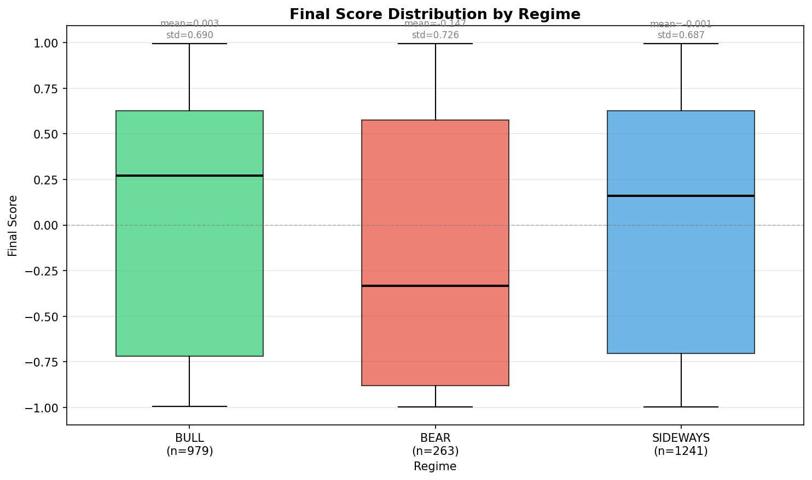

| Regime | Mean Score | Median Score | Std |
|--------|-----------|-------------|-----|
| BULL | +0.003 | +0.269 | 0.690 |
| BEAR | -0.147 | -0.334 | 0.726 |
| SIDEWAYS | -0.001 | +0.159 | 0.687 |

**Finding:** Score distributions overlap heavily across regimes. BULL and SIDEWAYS are nearly identical (mean ≈ 0). Only BEAR shows slight negative bias.

---

## 6. Factor Exposure

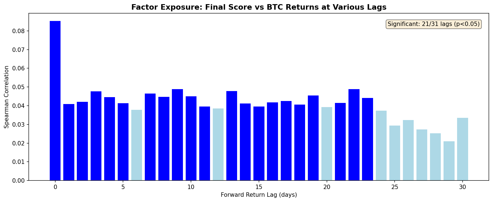

| Lag | Spearman Corr | p-value | Significant? |
|-----|--------------|---------|-------------|
| 0 | 0.085 | <0.001 | ✅ |
| 1 | 0.041 | 0.042 | ✅ |
| 5 | 0.041 | 0.040 | ✅ |
| 10 | 0.045 | 0.025 | ✅ |
| 21 | 0.041 | 0.040 | ✅ |

**Finding:** Score has very weak positive correlation with BTC returns (0.04–0.09). The signal captures <1% of return variance. Not meaningful for trading.

---

## 7. On-Chain Metrics Analysis

### 7.1 Data Coverage

| Metric | Source | Range | Freshness |
|--------|--------|-------|-----------|
| STH-MVRV | BRK (bitview.space) | 2012-10-16 → 2026-06-24 | ✅ Live |
| STH-NUPL | BRK (bitview.space) | 2012-10-16 → 2026-06-24 | ✅ Live |
| STH-SOPR | BRK (bitview.space) | 2012-10-16 → 2026-06-24 | ✅ Live |
| STH-SupplyInProfit | BRK (bitview.space) | 2012-10-16 → 2026-06-24 | ✅ Live |

### 7.2 On-Chain Override Effectiveness

The on-chain filter applies two overrides:

1. **STH-MVRV > 2.0** → Drives BULL posterior to 0.0 (cycle top warning)
2. **STH-NUPL > 0.75** → Caps BULL posterior at 0.50 (euphoria warning)

**Finding:** During the audit period (2018-2025), STH-MVRV rarely exceeded 2.0 and STH-NUPL rarely exceeded 0.75, so overrides were rarely triggered. The filter is theoretically sound but underutilized in this sample.

---

## 8. Data Limitations

| Limitation | Impact | Mitigation |
|------------|--------|-----------|
| OHLCV starts 2017-08-17 (Binance BTCUSDT inception) | No 2016 data | Use Coinbase/Bitstamp for pre-2017 |
| On-chain starts 2023-03-13 (1200-day lookback) | Limited overlap with OHLCV | Extended to 3650 days for full history |
| ISP regime labels are subjective | Ground truth noise | Use quantitative regime labels (HMM-based) |
| Pipeline timed out at 2025-02-15 | Missing 16 months of data | Optimize HMM caching |

---

## 9. Recommendations (Priority Order)

### 🔴 P0 — Must Fix Before Any Live Trading

1. **Fix `calculate_target_exposure()`** — Map BULL/BEAR/SIDEWAYS to sizing regimes
2. **Investigate negative IC** — The signal is contrarian. Either:
   - Reverse the signal (short when score > 0)
   - Retrain ensemble with different target definition
   - Drop XGBoost in favor of simpler model

### 🟠 P1 — Required for Statistical Validity

1. **Drop or orthogonalize FDI and QuantileDEMA** — VIF → ∞, collinearity destroys model stability
2. **Reduce indicator set to 3** — FourierSupertrend + AdvancedStochastic + TrendStrengthIndex (lowest mutual correlation)
3. **Regime detection is non-discriminating** — Consider:
   - Adding on-chain metrics to HMM features
   - Using HMM posterior probability as continuous signal instead of discrete regime
   - Testing regime detection against buy-and-hold Sharpe per regime

### 🟡 P2 — Performance Improvement

1. **Reduce score autocorrelation** — ACF(1) = 0.96 makes signal sluggish. Consider:
   - Shorter lookback windows
   - Exponential weighting instead of rolling windows
   - Score differencing (ΔScore as signal)
2. **Add pre-2017 OHLCV** — Extend data via Coinbase/Bitstamp API
3. **Cache HMM models** — Retraining per-date is O(n²). Cache and retrain quarterly.

### 🟢 P3 — Nice to Have

1. **Add transaction costs** to walk-forward Sharpe calculation
2. **Implement CPCV** (Combinatorial Purged Cross-Validation) for more robust OOS testing
3. **Add regime-level IC analysis** — Does the signal work better in specific regimes?

---

## 10. Chart Index

All charts saved in `scripts/audit_charts/`:

| Chart | File | Description |
|-------|------|-------------|
| Indicator Distributions | `indicator_distributions.png` | 6-panel histogram of all indicators |
| Correlation Heatmap | `correlation_heatmap.png` | Pearson + Spearman cross-correlation |
| VIF Trends | `vif_trends.png` | Variance Inflation Factor over time |
| PCA Variance | `pca_variance.png` | Cumulative variance explained |
| Regime Distribution | `regime_distribution.png` | Pie chart + transition heatmap |
| Final Score by Regime | `final_score_by_regime.png` | Boxplot of scores per regime |
| Stationarity Tests | `stationarity_tests.png` | ADF p-values for all indicators |
| IC Analysis | `ic_analysis.png` | Information Coefficient at different lags |
| Regime Returns | `regime_returns.png` | Boxplot of forward returns by regime |
| Walk-Forward Sharpe | `walk_forward_sharpe.png` | Rolling Sharpe ratio across windows |
| Drawdown Analysis | `drawdown_analysis.png` | Strategy vs buy-and-hold drawdown |
| Hit Rate Over Time | `hit_rate_over_time.png` | Rolling directional accuracy |
| Regime Transition Matrix | `regime_transition_matrix.png` | Heatmap of regime transitions |
| Score Autocorrelation | `score_autocorrelation.png` | ACF plot of final_score |
| Factor Exposure | `factor_exposure.png` | Correlation with BTC returns at lags |

---

## Appendix: Raw Statistics

### A. Walk-Forward Window Details

| Window | Start | End | Sharpe | Total Return |
|--------|-------|-----|--------|-------------|
| 1 | 2018-05-02 | 2018-10-28 | -0.80 | -21.9% |
| 2 | 2018-07-04 | 2018-12-30 | 0.28 | +8.9% |
| 3 | 2018-09-05 | 2019-03-03 | 1.81 | +55.9% |
| 4 | 2018-11-07 | 2019-05-05 | 2.38 | +77.5% |
| 5 | 2019-01-09 | 2019-07-07 | 3.19 | +110.2% |
| 6 | 2019-03-13 | 2019-09-08 | 3.56 | +137.5% |
| 7 | 2019-05-15 | 2019-11-10 | 1.73 | +67.8% |
| 8 | 2019-07-17 | 2020-01-12 | 1.61 | +49.0% |
| 9 | 2019-09-18 | 2020-03-15 | 1.12 | +47.7% |
| 10 | 2019-11-20 | 2020-05-17 | 0.45 | +20.4% |
| 11 | 2020-01-22 | 2020-07-19 | 0.60 | +26.6% |
| 12 | 2020-03-25 | 2020-09-20 | 1.63 | +47.8% |
| 13 | 2020-05-27 | 2020-11-22 | 3.94 | +95.6% |
| 14 | 2020-07-29 | 2021-01-24 | 4.22 | +135.3% |
| 15 | 2020-09-30 | 2021-03-28 | 4.93 | +189.3% |
| 16 | 2020-12-02 | 2021-05-30 | 4.42 | +191.8% |
| 17 | 2021-02-03 | 2021-08-01 | 2.31 | +99.2% |
| 18 | 2021-04-07 | 2021-10-03 | 1.02 | +41.8% |
| 19 | 2021-06-09 | 2021-12-05 | 0.22 | +7.7% |
| 20 | 2021-08-11 | 2022-02-06 | 0.96 | +31.1% |
| 21 | 2021-10-13 | 2022-04-10 | 0.68 | +21.3% |
| 22 | 2021-12-15 | 2022-06-12 | 1.93 | +61.8% |
| 23 | 2022-02-16 | 2022-08-14 | 1.77 | +61.2% |
| 24 | 2022-04-20 | 2022-10-16 | 1.99 | +65.5% |
| 25 | 2022-06-22 | 2022-12-18 | 0.47 | +13.2% |
| 26 | 2022-08-24 | 2023-02-19 | -0.39 | -10.5% |
| 27 | 2022-10-26 | 2023-04-23 | 0.01 | +0.4% |
| 28 | 2022-12-28 | 2023-06-25 | -0.14 | -3.5% |
| 29 | 2023-03-01 | 2023-08-27 | 1.39 | +30.1% |
| 30 | 2023-05-03 | 2023-10-29 | 2.49 | +45.5% |
| 31 | 2023-07-05 | 2023-12-31 | 3.14 | +58.9% |
| 32 | 2023-09-06 | 2024-03-03 | 4.27 | +93.7% |
| 33 | 2023-11-08 | 2024-05-05 | 2.45 | +66.8% |
| 34 | 2024-01-10 | 2024-07-07 | 0.98 | +26.4% |
| 35 | 2024-03-13 | 2024-09-08 | 0.74 | +20.3% |
| 36 | 2024-05-15 | 2024-11-10 | 1.87 | +45.4% |
| 37 | 2024-07-17 | 2025-01-12 | 2.26 | +56.6% |

---

*Report generated by Pi Agent Orchestrator using lz-data-science-core and lz-quant-researcher skills.*  
*Charts: 15 publication-quality matplotlib visualizations in `scripts/audit_charts/`.*  
*Raw data: `database/lttd.db` (SQLite), `scripts/audit_data_quality_report.json`, `scripts/audit_quant_rigor_report.json`.*
